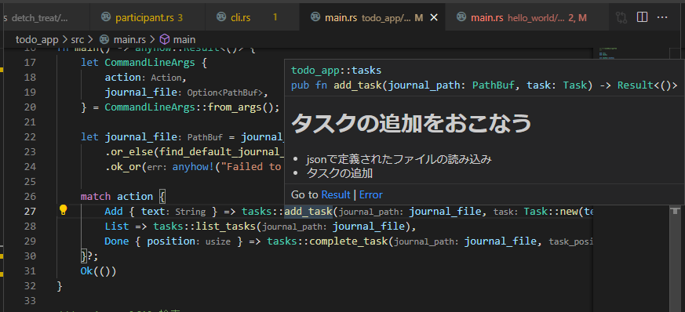
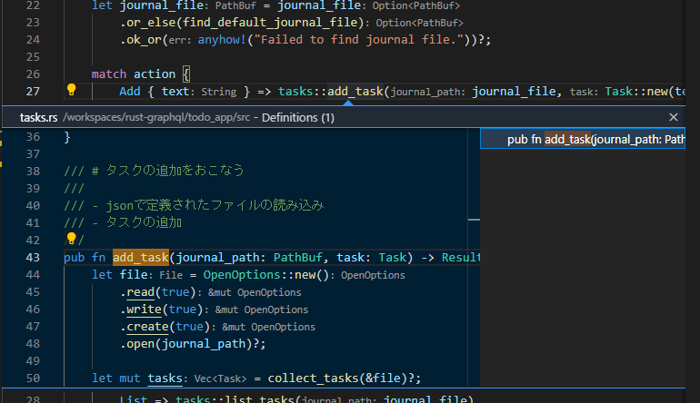
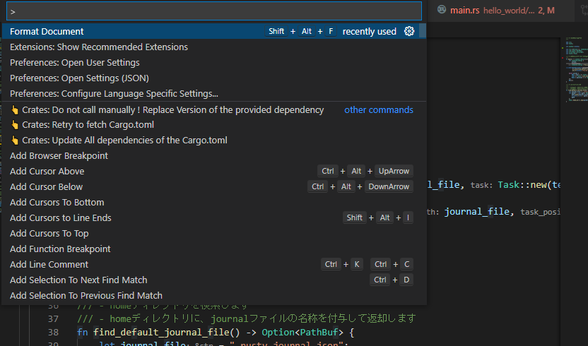
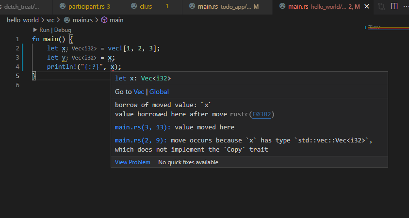

<!-- フォントのimport -->
<style>
@import url('https://fonts.googleapis.com/css2?family=Kosugi&display=swap');
</style>

<style>
h1 {
    font-size: 53px;
    font-weight: bold;
    color: #008080;
}
section {
    font-family: 'Kosugi', sans-serif;
}
section.box p {
    padding: 0.5em;
    margin: 0.5em;
    color: #ffffff;
    background: #008080;
    text-align: center;
}
section.agenda, section.text {
    justify-content: start;
}
section.subtitle {
    font-size: 50px;
    color: #008080;
}
section.subsubtitle p {
    padding: 0.25em 0.5em;
    font-size: 35px;
    color: #008080;
    border-top: solid 5px #008080;
    border-bottom: solid 5px #008080;
}
</style>

<!-- _class: title -->

# 苦しんで覚える Rust

---

<!-- _class: text -->

## はじめに

- 正月休み付近で、なんとなく Rust を触り始めたらハマりました。
- 今後流行る予感がしてるので、この 3 週間で学んだことを共有します。
- 当スライドのタイトルは、名著「[苦しんで覚える C 言語](https://www.amazon.co.jp/dp/B07H2WH1F4/ref=dp-kindle-redirect?_encoding=UTF8&btkr=1)」から拝借しました。
- 当スライドは、プレゼンテーションよりもナレッジの共有の意味合いが強く、凝ったデザインではありません。そのため[marp](https://github.com/marp-team/marp) で作りました、見苦しかったらごめんなさい。`https://github.com/ShunichirouKamino/marp-ci`でビルドしてるので、興味ある人は Fork してください。

---

<!-- _class: text -->

## ゴール

- Rust で`Hello World!`ができるようになる。
- なんとなく Rust の良さがわかる。
- なんとなく Rust の難しさが分かる。

---

<!-- _class: text -->

## 目次

- とりあえず Hello World をやってみよう！
- Rust が流行りそうな理由
- ソースコードを読んでみよう
- おわりに

---

<!-- _class: subtitle -->

## とりあえず Hello World をやってみよう！

---

<!-- _class: text -->

### 環境構築手順

- C++ Build Tools のインストール
  https://visualstudio.microsoft.com/ja/visual-cpp-build-tools/
- Rust のインストール
  https://www.rust-lang.org/tools/install
- VSCode に拡張プラグインのインストール
  - "matklad.rust-analyzer"
  - "vadimcn.vscode-lldb"
- プラグインの設定
  - rustup component add rust-src
  - rustup component add rust-analysis
  - rustup component add rls

---

<!-- _class: text -->

### 環境構築手順（おすすめ）

- 事前準備

  - Docker Desktop, VSCode

- 手順
  - `$ git clone https://github.com/ShunichirouKamino/rust-sandbox.git -b main rust-sandbox`完了後、VSCode でプロジェクトルートを開く
  - `Extensions`の`RECOMMENDED`にある`Remote - Containers`を install
  - VSCode 左下の緑の部分(`Open a Remote Window`)をクリックすることで、自動でリモートコンテナ上で VSCode を開く
    - 初回はコンテナのビルドに多少時間がかかります
    - コマンドパレットが開いた場合は、`Reopen in Container`を選択します

---

<!-- _class: text -->

### Hello World

- `$ cd hello_world`
- `$ cargo run`
  - cargo により、コンパイルから実行までをワンライナーで行う
  - > Hello, world!
- `$ cd src`
- `$ rustc main.rs`
  - コンパイルする
- `$ ./main`
  - コンパイルして実行形式となったモジュールを実行する
  - > Hello, world!

---

<!-- _class: text -->

### Gussing Game

- `$ cd guessing_game`
- `$ cargo run`

```sh
    Finished dev [unoptimized + debuginfo] target(s) in 0.18s
     Running `target/debug/guessing_game`
Guess the number!
The secret number is: 5
Please input your guess.
100
You guessed: 100
Too big!
Please input your guess.
5
You guessed: 5
You win!
```

---

<!-- _class: subtitle -->

## Rust が流行りそうな理由

---

<!-- _class: subsubtitle -->

Rust のいいところ

---

<!-- _class: box -->

Rust はメモリ安全な言語です

Rust はリッチな型システムがあります

Rust はエラー処理が分かりやすい

Rust は健全なコミュニティの有るエコシステムです

---

<!-- _class: subsubtitle -->

Rust はメモリ安全な言語です

---

<!-- _class: text -->

### Rust はメモリ安全な言語です

プログラミング言語によるメモリ管理には、これまで 2 種類の方法が有りました。

- プログラマが全責任をもって管理する
  - 例）C 言語

```c
    char *str;
    int length = 100; // 100byte（半角文字100文字分）確保
    str = (char*)malloc(sizeof(char) * length);
    if (str == NULL)
    {
      .. // メモリの確保に失敗した場合の処理
    }
    free(str); // メモリの解放
```

- システムが GC によって自動で不要なメモリをかき集める
  - 例）Java, Python

---

<!-- _class: text -->

### Rust はメモリ安全な言語です

Rust は、第三の方法でメモリ管理を行っております。
それが、「所有権」という考え方で、以下のルールで成り立ちます。

- ① 値は、変数が束縛しており、変数のことを所有者と呼ぶ
- ② 値の所有者は、その瞬間は 1 つの変数のみ
- ③ 所有者である変数のスコープを抜けた際に、その値は利用不可能になる
- ④ 借用という考え方により、所有権を貸し出すことができます

Rust では、このルールがあることで、プログラマ自身がメモリの管理をすることなく、かつ GC が無いにも関わらずメモリを利用することができます。

---

<!-- _class: text -->

### Rust はメモリ安全な言語です

以下の例で、"hello"の所有者は`s`です。
`s`のスコープは`f()`内のため、ルール ③ により、`f()`の外では`s`にアクセスできません。

これは、スコープの概念を持つ言語、Java でも同様の動きをします。

```rust
fn f() {
    let s = "hello";
    // sを使った処理
}
// ここではsにアクセスすることはできない
```

---

<!-- _class: text -->

### Rust はメモリ安全な言語です

以下の例で、`let s = "hello";`の時点で"hello"の所有者は`s`です。
`get_length`に`s`を渡すと、s の所有者は get_length 内の`s`に移ります。
ルール ② により、`get_length`以降`f()`では`s`にアクセスすることはできません。

```rust
fn get_length(s: String) -> usize {
    s.len()
}

fn f() {
    let s = "hello";
    let len = get_length(s);
    // ここではsにアクセスすることはできない
}

```

---

<!-- _class: text -->

### Rust はメモリ安全な言語です

別の変数に代入した場合も、ルール ② により"hello"の所有者が移ります。これを、Rust では`move`と呼びます。

```rust
fn f() {
    let s = "hello";
    let s2 = s;
    // ここではsにアクセスすることはできない
}
```

---

<!-- _class: text -->

### Rust はメモリ安全な言語です

ルール ④ の借用により、所有権を read-only でレンタルすることができます。
借用は、`s`が immutable の場合のみ（Rust ではデフォルトで変数は final）可能です。

```rust
fn get_length(s: String) -> usize {
    s.len()
}

fn f() {
    let s = "hello";
    let s2 = &s;
    // sにアクセスすることが可能
    let len = get_length(&s);
    // sにアクセスすることが可能
}
```

---

<!-- _class: text -->

### 所有権の仕組みの何がすばらしいのか？

以下の例では、println の引数として`greet`を参照していますが、その前の`let greet2 = greet`の時点で所有権は`move`しています。
これにより、

- 実行する前にコンパイル時点でエラーを出力してくれるため、メモリ解放忘れによる実行中メモリリークのようなことは起きづらくなります。
- プログラマが手出しできない GC が無いため、全てのメモリリークの要因はコード上に存在します。

```rust
fn f() {
    let greet = vec!["Hello", "What's up?", "How is everything?"];
    let greet2 = greet;

    println!("{:?}", greet); // ここで静的コンパイルエラー
}
```

---

<!-- _class: subsubtitle -->

Rust はリッチな型システムがあります

---

<!-- _class: text -->

### Rust はリッチな型システムがあります

- struct
  - 直積型です。C 言語でいう構造体と同じです。メソッドの無い class のイメージです。

```rust
#[derive(Debug)]
struct Person {
    name: String,
    age: u8,
}

fn f() {
    let taro = Person {
        name: String::from("taro"),
        age: 27,
    };
    println!("{:?}", taro); // Person { name: "taro", age: 27 }
}
```

---

<!-- _class: text -->

### Rust はリッチな型システムがあります

- enum
  - 列挙型です。Java の Enum と同じです。

```rust
#[derive(Debug)]
enum IpAddrKind {
    V4,
    V6,
}

fn f() {
    let v4 = IpAddrKind::V4;
    let v6 = IpAddrKind::V6;

    println!("{:?}, {:?}", v4, v6); // V4, V6
}
```

---

<!-- _class: text -->

### Rust はリッチな型システムがあります

- 直和型
  - 取りうるすべての型の羅列です。TypeScript では`a = number | string`のように表現され、Java では Java17 以降、`sealed`構文と`record`構文により実現されます。

```rust
/// Actionは、ToDoリストにおけるアクションを示す直和型です。
/// 複数のstructの列挙型で表現され、AddにもDoneにもListにもなれます。
pub enum Action {
    Add {
        text: String,
    },
    Done {
        position: usize,
    },
    List,
}
```

---

<!-- _class: text -->

### Rust はリッチな型システムがあります

- trait
  - 共通の振る舞いを定義します。struct に付与することで、クラスのような振る舞いが可能です。

```rust
struct Person {
    name: String,
    age: u8,
}

pub trait Judge {
    fn isOver30(&self) -> bool;
}

impl Judge for Person {
    fn isOver30(&self) -> bool {
        self.age > 30
    }
}
```

---

<!-- _class: text -->

### 型システムが豊富なことは何が素晴らしいのか？

ドメイン知識を実装する幅が広がります。例えば Java では列挙型に対して、以下の制約が有ります。

- 変数が持てない
- 列挙値毎に定数の数は固定

```java
enum IpAddr {
    V4("127.0.0.1"),
    V6("::1"),

    private final String loopBack;

    public String getLoopBack(){
        return this.loopBack;
    }
}
```

---

<!-- _class: text -->

### 型システムが豊富なことは何が素晴らしいのか？

Rust では、以下のように列挙値をそれぞれ別の型で表現できます。（直和型）
この仕様により、ドメイン知識を実装する幅が広がります。

```rust
enum IpAddr {
    V4 (u8, u8, u8, u8), // 8byte整数値を4つ持つタプル
    V6 { loopBack: String }, // Stringを1つもつstruct
}

fn f() {
    let v4LoopBack = IpAddr::V4(127, 0, 0, 1);
    let v6LoopBack = IpAddr::V6 {
        ip: "::1".to_string(),
    };
    println!("{:?}, {:?}", v4LoopBack, v6LoopBack); // V4(127, 0, 0, 1), V6 { ip: "::1" }
}
```

---

<!-- _class: text -->

### 型システムが豊富なことは何が素晴らしいのか？

パターンマッチングによる分岐処理が簡潔に書けます。

```rust
pub enum Action {
    Add {text: String, }, // 文字列変数を保持する構造体
    Done {position: usize, },  // usize型の数値変数を保持する構造体
    List,  // 列挙定数のみ
}

fn f() {
    let action = XXX::from_args(); // コマンドラインから何らかの値を取得

    match action {
        Add { text } => ..., // 文字列の場合の処理
        List => ... , // 何も指定されなかった場合の処理
        Done { position } => ... , // 数値の場合の処理
};
```

---

<!-- _class: subsubtitle -->

Rust はエラー処理が分かりやすい

---

<!-- _class: text -->

### Rust はエラー処理が分かりやすい

- Java におけるエラー処理
  - 検査例外の Exception により、上位レイヤでキャッチします。
  - 上位のモジュールでは、`try-catch`の記載が必須となります。

```java
public void any() {
    try {
        final var file = open("../input/input.json");
        // 何らかの処理
    } catch (IOException ex) {
        throw ex;
    }
}

public File open(String fileName) throws IOException {
    return new File(fileName);
}
```

---

<!-- _class: text -->

### Rust はエラー処理が分かりやすい

- Java におけるエラー処理
  - 非検査例外の Exception により、Runtime 時の Exception を定義します。
    - `NullPointerException`, `ArrayIndexOutOfBoundsException`等
  - 上位のモジュールでは、`try-catch`の記載が任意となります。

```java
public void any() {
    final var file = open("../input/input.json");
}

public InputStream open(String fileName) {
    try {
        return new FileInputStream(fileName);
    } catch (final FileNotFoundException e) {
        throw new UncheckedIOException(e);
    }
}
```

---

<!-- _class: text -->

### Rust はエラー処理が分かりやすい

Java におけるエラー処理の課題は？

- 検査例外と非検査例外の使い分けとしては、検査例外は、「呼び出し側で発生を避けられないもの」です。しかし境界が曖昧で、例えば`NullPointerException`は非検査例外（呼び出し側で発生を避けられるもの）の定義ですが、実際は実行するまで見逃されることがほとんどです。
- 結果として、大原則である「Exception を握りつぶしてはいけない」について、実装時に見逃すことになります。上記の例で非検査例外である`NullPointerException`は、コンパイル時に検査できません。
- Exception の実装が、他の Class の実装と異なるためある程度学習コストがかかります。実際に Java を書いている人でも、Exception を何となく実装したり、Exception そのものの実装をしたことが無い人がほとんどではないでしょうか。

---

<!-- _class: text -->

### Rust はエラー処理が分かりやすい

- VBA におけるエラー処理
  - VBA や C 言語のような例外機構が存在しない言語では、GoTo にてエラーハンドリングを行うことがあります。

```vb
Sub 実行()
    On Error GoTo Catch ' エラーが発生したら Catch の行へ処理を飛ばす
    Dim i As Integer
    i = "a"  ' エラー発生
    Exit Sub ' 正常に処理が行われたときに Catch: の処理を行わないように、ここで関数を抜ける
    Catch:
    ' エラー処理
End Sub
```

---

<!-- _class: text -->

### Rust はエラー処理が分かりやすい

VBA におけるエラー処理の課題は？

- GoTo 文は、何よりも先に解析されるため、非常に強力な構文です。結果として、処理がどこに飛ぶか分からないスパゲッティコードが生まれる原因となります。故に、GoTo 文を禁止する案件も少なくありません。
- そうはいっても、書き換えて関数呼び出しのネストが深い処理になってしまう場合や、メモリのクローズ忘れを防ぐ等、有用なシーンでの共通処理を定義しておくことができるため、完全には無くならないのが現状です。

---

<!-- _class: text -->

### Rust はエラー処理が分かりやすい

Rust の回復可能なエラー処理（検査例外）は、以下の 2 つの列挙型を返り値とすることで実現されます。

```rust
pub enum Result<T, E> {
    Ok(T),
    Err(E),
}

pub enum Option<T> {
    None,
    Some(T),
}
```

---

<!-- _class: text -->

### Rust はエラー処理が分かりやすい

Rust の回復不可能なエラー処理（非検査例外）は、`panic!`を発生させることで実現されます。panic!が発生すると、デフォルトではこれまで確保したメモリ等を自動的に開放していきます。

```rust
fn main() {
    panic!("crash and burn");  //クラッシュして炎上
}
```

---

<!-- _class: text -->

### Rust はエラー処理が分かりやすい

`Result`と`Option`が列挙型で実装されているということは、パターンマッチングの記法が使えます。

- `Result`は 2 つのジェネリクス定義が必要ですが、ほとんどの場合利用 Crate 内でラップされており、返り値側のみ指定すれば良いことがほとんどです。

```rust
pub fn add_task(task: String) -> Result<String> {
    // タスクの追加処理
}

pub fn any() -> Result<String> {
    let ret = match add_task("new task") {
        Ok(ret) => ret,
        Err(e) => return Err(e),
    };
    // retを使った処理
}
```

---

<!-- _class: text -->

### Rust はエラー処理が分かりやすい

`?`によるシンタックスシュガーが用意されており、`Result`を返す関数を複数呼び出しても、簡潔に記載することができます。

- `?`の役割は、「パターンマッチングを行ったうえで、`Ok` なら処理が進み、`Err` なら return する」という意味です。

```rust
fn add_task_from_file(file_name: String) -> Result<String, io::Error> {
    let mut f = File::open(file_name)?; // Resultが返却される関数
    let mut s = String::new();

    f.read_to_string(&mut s)?; // Resultが返却される関数
    add_task(s)?; // Resultが返却される関数

    Ok(s) // 最後に評価された式が返り値になり、returnの省略が可能
}
```

---

<!-- _class: text -->

### Rust はエラー処理が分かりやすい

最終的に回復が不要と判断し、非検査例外とする場合は`panic!`を発生させるだけです。

```rust
pub fn add_task(task: String) -> Result<String> {
    // タスクの追加処理
}

pub fn any() -> Result<String> {
    let ret = match add_task("new task") {
        Ok(ret) => ret,
        Err(e) => {
            panic!("Tried to add task: {:?}", e)
        }
    };
    // retを使った処理
}
```

---

<!-- _class: text -->

### Rust におけるエラー処理は何がうれしいのか？（まとめ）

- 検査例外と非検査例外の定義がはっきりしており、実装時に一目で分かる。
- エラーようの型が定まっていることで返り値にエラーを含むため、修復すべきエラーの握り潰しが発生しづらい。
- GoTo によるスパゲッティコードを産まず、保守性の高いコードが書ける。

---

<!-- _class: subsubtitle -->

Rust は健全なコミュニティの有るエコシステムです

---

<!-- _class: text -->

### Rust は健全なコミュニティの有るエコシステムです

エコシステムは、一つの OSS を中心として、それを取り巻く生態系のことを指します。エコシステムの発達度と言語の発展は、少なからず依存関係が有ります。

- コンテナエコシステムで言うと、ランタイムは Docker や cri-o や Railcar 等が存在し、オーケストレーションでは k8s や Docker Compose、SaaS では ECS・EKS・GKE、今では Argo や Istio, velero 等の CRD もエコシステムに含まれます。
- Java のエコシステムでいうと、Maven や Gradle のビルドツールや、フレームワークである Spring boot, helidon, Quarkus、IDE や関連では Eclipse Foundation が有名で、AdoptOpenJDK が寄贈されたことも最近話題になりました。

---

<!-- _class: text -->

### Rust は健全なコミュニティの有るエコシステムです

この先の説明で登場する用語について、いくつか事前に解説します。

- LSP
  - language server protocol です。エディタや IDE が保有するソースを解析し、静的解析やフォーマット、自動補間などを行うバックエンドサービスとのプロトコルです。1 つの解析用 Language Server を実装することで、複数の IDE やエディタから利用されることが可能になりました。Microsoft さんが 2016 年に公開し、VSCode の発展に大きく寄与しています。
- Crate
  - クレートと読みます。Rust における 1 つのプロジェクト単位を指し、ライブラリでも有ります。`bin`形式と`lib`形式が有り、自作したライブラリは[crates.io](https://crates.io/)にて公開することができます。

---

<!-- _class: text -->

### Rust は健全なコミュニティの有るエコシステムです

Rust では、以下のようなエコシステムが有ります。

- コンパイラ
  - `rustc`でコンパイルができます。Java における`javac`や C 言語における`gcc main.c -o main`のようなものです。
- ビルドツール・パッケージマネージャ
  - `Cargo`により、プロジェクトのビルドからパッケージマネージまで全て行ってくれます。また依存ライブラリのダウンロードや、テスト、ドキュメント生成等も可能な便利ツールです。
- ツールチェーン管理
  - `rustup`により、`rustc`や`cargo`等のツール群を一式インストールしてくれます。また、`rust-analyzer`や`rls`といった LSP、`rust-fmt`といったフォーマッタ、`clippy`といった Linter ツールも管理されます。

---

<!-- _class: text -->

### Rust は健全なコミュニティの有るエコシステムです

- `rls`を導入すると、マウスオーバーで定義の参照が可能になります。



---

<!-- _class: text -->

### Rust は健全なコミュニティの有るエコシステムです

- `rls`を導入すると、参照先のインライン表示が可能になります。



---

<!-- _class: text -->

### Rust は健全なコミュニティの有るエコシステムです

- `rls`を導入すると、フォーマッタが利用できるようになります。



---

<!-- _class: text -->

### Rust は健全なコミュニティの有るエコシステムです

- `rls`を導入すると、エラー箇所の静的解析を行ってくれます。



---

<!-- _class: text -->

### Rust は健全なコミュニティの有るエコシステムです

その他エコシステム

- [microsoft/vscode-dev-containers](https://github.com/microsoft/vscode-dev-containers/tree/main/containers/rust)によりリモートコンテナ用の Image が提供されており、VSCode での環境構築が簡単にできます。

- [crates.io](https://crates.io/)により、ライブラリの公開が可能です。[npm](https://www.npmjs.com/)のようなものです。

---

<!-- _class: text -->

### Rust は健全なコミュニティの有るエコシステムです

その他エコシステム

- [microsoft/vscode-dev-containers](https://github.com/microsoft/vscode-dev-containers/tree/main/containers/rust)によりリモートコンテナ用の Image が提供されており、VSCode での環境構築が簡単にできます。

- [crates.io](https://crates.io/)により、ライブラリの公開が可能です。[npm](https://www.npmjs.com/)のようなものです。

---

<!-- _class: text -->

### Rust は健全なコミュニティの有るエコシステムです

その他エコシステム

- [microsoft/vscode-dev-containers](https://github.com/microsoft/vscode-dev-containers/tree/main/containers/rust)によりリモートコンテナ用の Image が提供されており、VSCode での環境構築が簡単にできます。

- [crates.io](https://crates.io/)により、ライブラリの公開が可能です。[npm](https://www.npmjs.com/)のようなものです。

---

<!-- _class: subtitle -->

## ソースコードを読んでみよう！

---

<!-- _class: text -->

### ソースコードを読んでみよう！

これまで Rust のいいところのみを淡々と語ってきましたが、Rust は学習コストが高いと言われています。
ここから個人的にハマった構文や、その他言語とは異なる構文について淡々と説明します。

---

<!-- _class: text -->

### ソースコードを読んでみよう！

- **Hello, world で登場するエクスクラメーションマーク**
  - メタプログラミングの文脈で登場する、マクロという構文です。
  - 関数と使い方が似ていますが。一言でいうと、プログラムをプログラミングする為の構文です。
  - 関数と違い、引数を可変数取ることが可能です。

```rust
fn main() {
    let x = "Hello, world";
    println!("Hello, world");
    println!("{}", x);
}
```

- マクロの使い方を学ぶだけなら簡単ですが、マクロを自作したり、マクロの中身を理解しようとすると飛躍的に難易度が上がります。

---

<!-- _class: text -->

### ソースコードを読んでみよう！

- **返り値があるのに return が無い関数**
  - Rust では、最後の式で評価された値が戻り値になります。
  - 『式』は値を返し、『文』は値を返しません。
  - 式には`;`が不要で、よく見ると最後の節は式になっています。

```rust
fn parse() -> Result<i32, ParseIntError> {
    let number = match "10".parse::<i32>() {
        Ok(number) => number,
        Err(e) => return Err(e),
    };
    Ok(number)
}
```

- よく見るのは返り値 Result に対して、最後が Ok で終わる関数です。

---

<!-- _class: text -->

### ソースコードを読んでみよう！

- **if let**
  - デストラクチャリング（分割代入）と if 演算が同時に行われ、その後の処理の有無が決定します。

```rust
enum Foo {
    GRID { x: f64, y: f64 }
    POINT { x: f64 }
}

fn main() {
    let g = Foo::GRID {x: 0.1, y: 0.2};
    if let Foo::GRID {x, y} = g { // デストラクチャリングにより、分割代入が行われる
        println!("{}, {}", x, y); // 分割代入が成功した場合のみ、0.1, 0.2が出力
    }
    if let FOO::POINT {x, y} = g {  // POINTにgは代入できない
        println!("{}, {}", x, y); // ここの分岐には到達しない
    }
}
```

---

<!-- _class: text -->

### ソースコードを読んでみよう！

- **|x| x + 1**
  - クロージャです。Rust におけるクロージャとは、Java におけるラムダ式であり、匿名関数です。
  - `JavaScript`におけるクロージャとは、関数とその関数が参照可能な変数スコープのことですが、Rust では少し意味が違うようです。
    - とはいえ以下の例では、匿名関数 f が束縛する変数範囲は main のスコープまでなので、全く遠い概念ではありません。

```rust
fn main() {
    let a = 50;
    let f = |x| x + a;
    println!("{}", f(10)); // 60
}
```

---

<!-- _class: subtitle -->

## おわりに

---

<!-- _class: text -->

## おわりに

- いくつかの言語を網羅的に学んでいると、共通点などからキャッチアップが早くなります。Rust の例だと、C 言語界隈からの`struct`や、JavaScript からの`デストラクチャリング`がそれにあたります。
- Java で直和型が使えるようになって喜んでましたが、Rust ではデフォルトで利用できます。直和型は業務ドメインを実装に落とす際にとても便利なので、今後は多用したいです。Java における直和型は、手前味噌ですがこちらを参照ください。`https://zenn.dev/khale/articles/java-17-tips#%E4%BB%A3%E6%95%B0%E7%9A%84%E3%83%87%E3%83%BC%E3%82%BF%E5%9E%8B`
- 上半期の目標は、m5 の認証サーバーを Rust で実装しようかなと思います。GraphQL でやってみるかもしれません。

---

<!-- _class: text -->

## 課題

- Rust では型システムが豊富ですが、オブジェクトを表す本体は struct のみです。つまり継承ができません。trait にて継承を無理やり実装するか、struct 内に struct を保持する合成を利用するやり方が有り、ベストな方法を探り中です。
- struct の vec に対して、各要素に対して処理をしたい際に map では read-only となるためどのように実装すべきか。

---

<!-- _class: text -->

## おわりに

- 最後にいくつかアプリを作ったので、デモをします。
  - ToDo アプリ
    - https://github.com/ShunichirouKamino/rust-sandbox/tree/main/todo_app
  - 割り勘アプリ
    - https://github.com/ShunichirouKamino/rust-sandbox/tree/main/detch_treat
